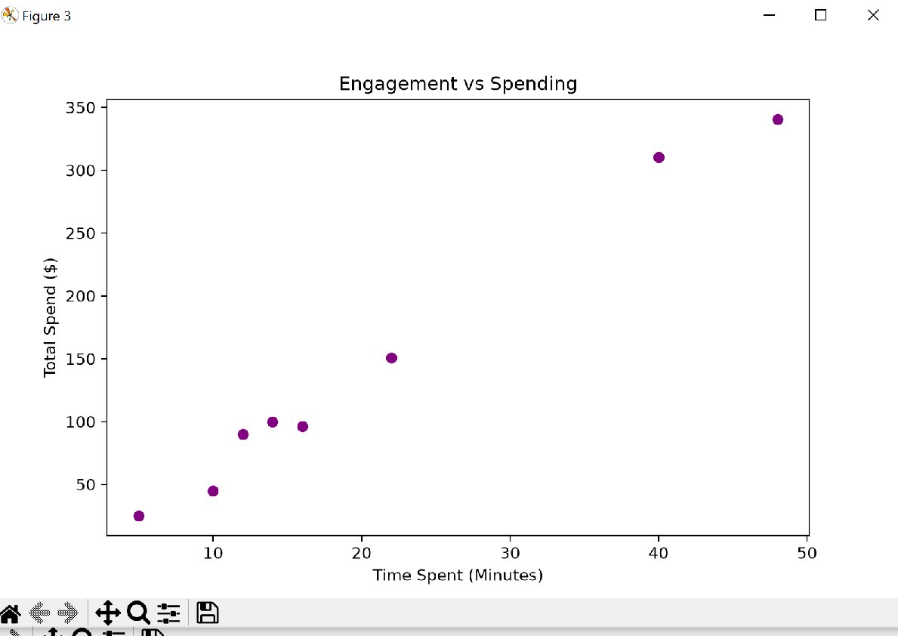
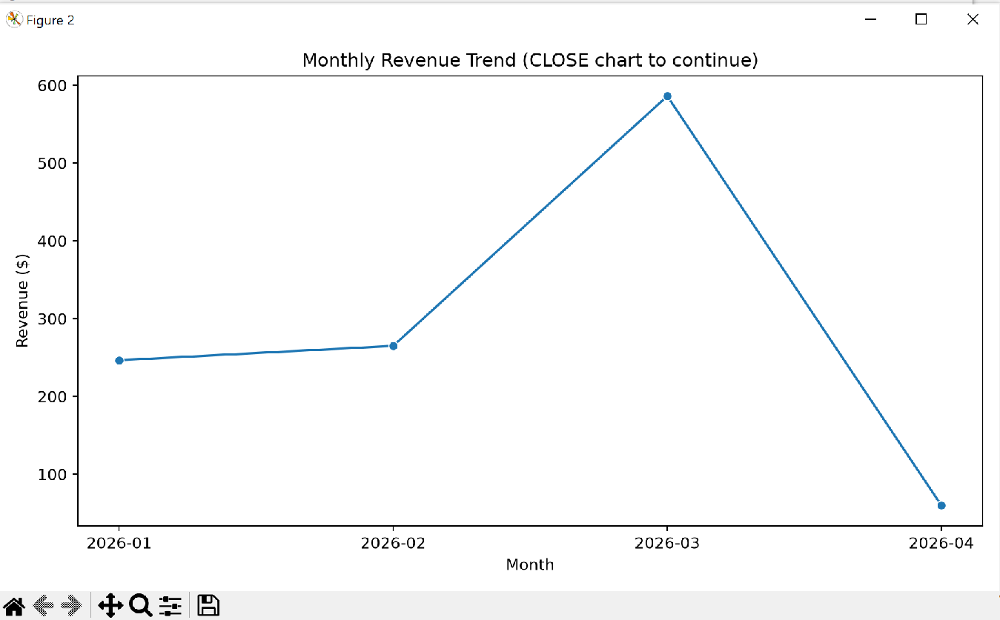
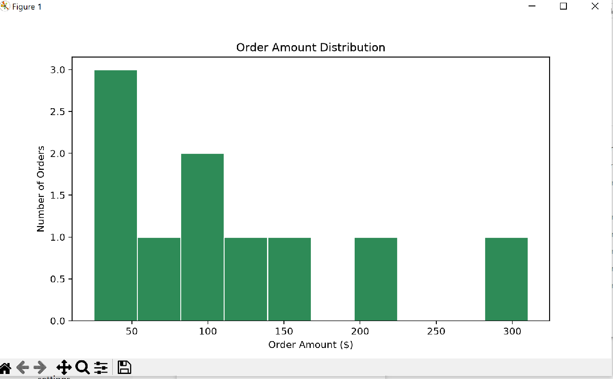

# Project Documentation

This site provides project documentation.
Use the documentation navigation to explore.

## How-To Guide

Many instructions are common to all our projects.

See
[⭐ **Workflow: Apply Example**](https://denisecase.github.io/pro-analytics-02/workflow-b-apply-example-project/)
to get the example projects running on your machine.

## Project Documentation Pages (docs/)

- **Home** - this documentation landing page
- [**Project Instructions**](./project-instructions.md)  - the standard project workflow
- [**Your Files**](./your-files.md) - how to copy the example and create your version
- [**Glossary**](./glossary.md) - project terms and concepts
- [**API**](./api.md) - autogenerated code documentation for the public project interface

## Phase 4. Technical Modification

Describe your small technical modification to the example project.

I added two additional charts. The first chart shows total sales amount by product. Comparing sales by product helps identify which products generate the most revenue. This supports decisions about inventory planning, product strategy, and sales priorities. The second chart shows the sales distribution among top products. A pie chart shows the percentage contribution of each product to total sales. This helps identify products that have the largest impact on overall revenue.
Include:

- What you changed: I changed the number of output charts from two to four. 
- Why you chose that change: I chose that because I wanted to add another meaning to the project that can help in business decisions.
- How you verified that it worked: The project ran successfully and generated the expected result. 
- What result, output, chart, metric, or behavior confirmed the change: The two additional charts confirmed the change.

Compared with the example project,
explain what is different and why the change matters.
The new charts provide more insight than the original charts because they focus on product-level sales performance. The previous charts showed overall patterns (price distribution and sales trends over time), while the new charts indicate which products contribute most to revenue and how sales are distributed among products.

Was it easy, or surprisingly challenging, and why do you think so? I will say moderate because it was a good exercise.

## Phase 5. Custom Project

Describe your custom data mining and exploration work.

### Basis and Data

Describe the raw data you worked with.

The project begins with data collection and preparation by creating or loading three core datasets:

Customer data — contains customer profiles, countries, signup dates, and loyalty tiers.
Order data — contains transactions, order dates, order amounts, and product categories.
Web activity data — contains customer browsing behavior, including pages viewed and time spent on the website.

The program automatically generates sample CSV files to create a self-contained analytics environment.

### Mining Approach

The step is data inspection and quality analysis. Each dataset is loaded into a pandas DataFrame and examined for:

Dataset size (rows and columns)
Column names and data types
Missing values
Duplicate records
Basic data quality issues

This step ensures that the data is reliable before performing analysis.

After validation, the project performs data preparation and transformation. Key transformations include:

Converting order amounts into numeric values.
Aggregating sales data by month to identify revenue patterns.
Combining customer purchase data with web activity data to analyze relationships between engagement and spending.

### Findings

The exploration phase uses descriptive analytics and visualization techniques to uncover business insights:

Order Amount Distribution
A histogram is created to understand customer purchasing patterns.
This helps identify typical order sizes and variation in spending behavior.
Revenue Trend Analysis
Monthly revenue is calculated and displayed using a line chart.
This reveals growth patterns, seasonal changes, and overall sales performance.
Customer Engagement vs. Spending Analysis
Website activity data is combined with order history.
A scatter plot evaluates whether customers who spend more time on the website also generate higher revenue.

### Summary

Summarize your custom data mining work.
Finally, the project produces a summary of the explored datasets, providing a foundation for future BI development, such as dashboards, customer segmentation, revenue forecasting, and marketing optimization.
Include:

- What you implemented beyond the example: I expanded the original mining example into a custom E-Commerce Growth Analytics project using three related datasets—customers, orders, and web activity—with automatic sample data generation for independent execution. The project analyzes customer engagement alongside sales performance and includes visualizations such as an order amount distribution, monthly revenue trend, and a website engagement versus customer spending scatter plot.
- What results or insights you produced: The project provided insights into customer behavior, sales trends, and the relationship between website engagement and spending through integrated data analysis and visualizations.
- What you learned: I learned how to integrate multiple related datasets, automate sample data generation, analyze customer engagement alongside sales data, and use visualizations to identify business trends and customer behavior patterns.
- What kinds of real business problems this approach could help answer: This approach could help businesses answer questions such as which customers are most valuable, how website engagement influences purchasing behavior, what sales trends emerge over time, and where marketing or customer retention efforts could be improved to increase revenue.
  

Display at least one chart or screenshot showing your work.

